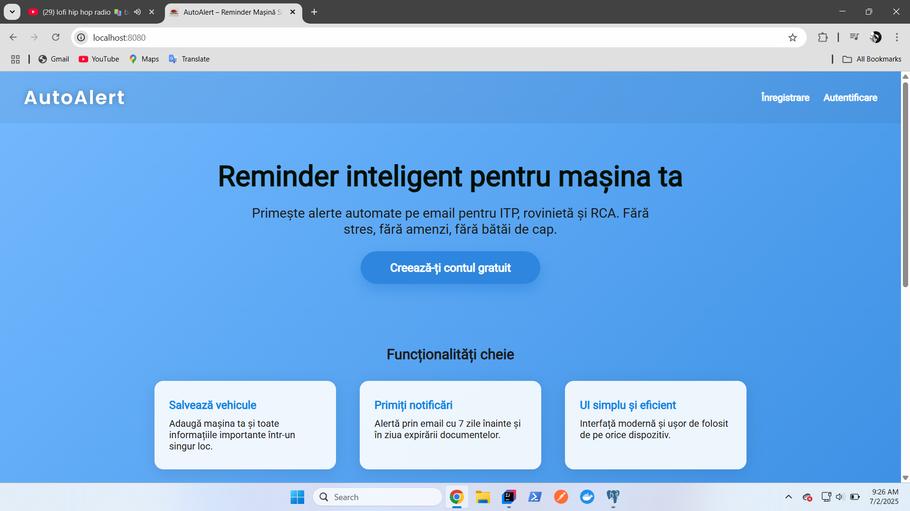
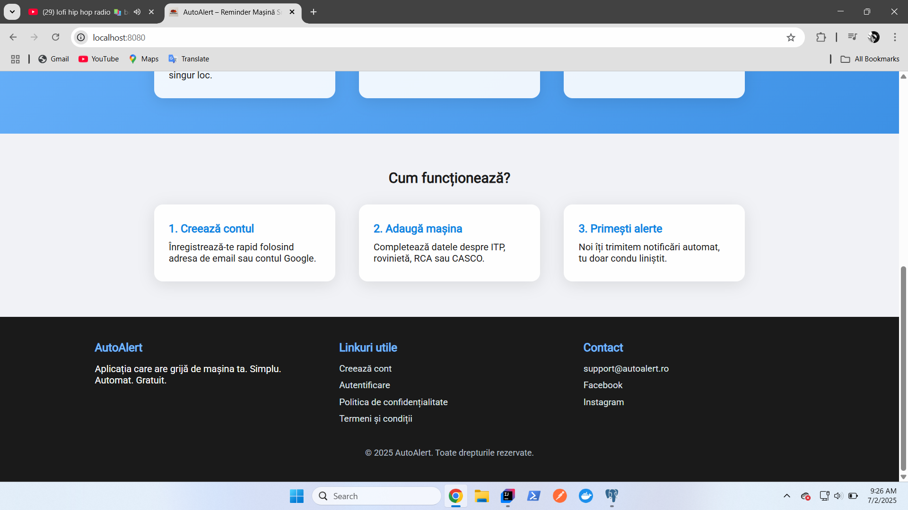
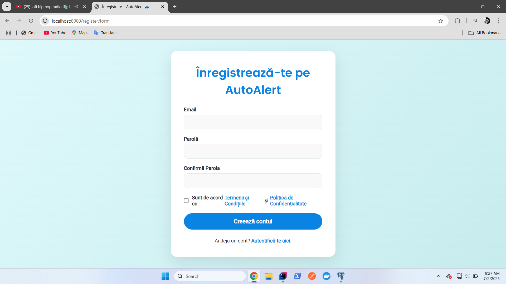
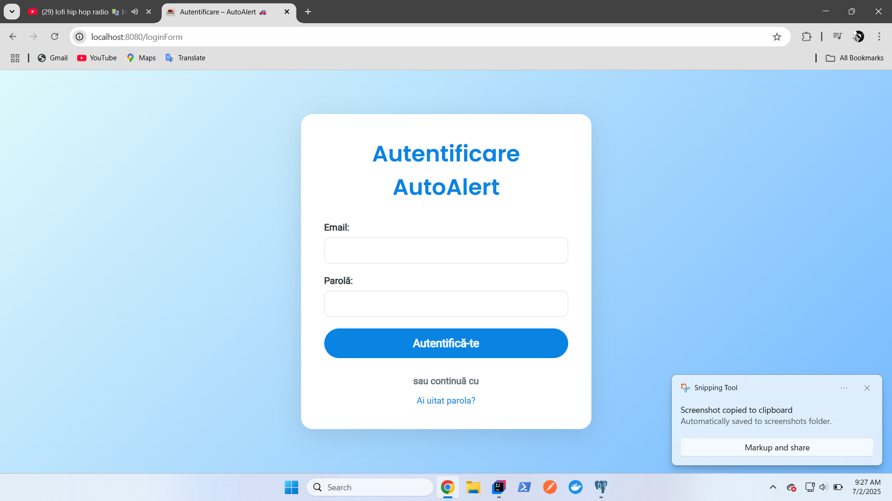
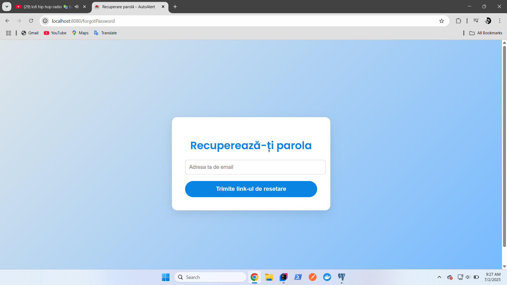
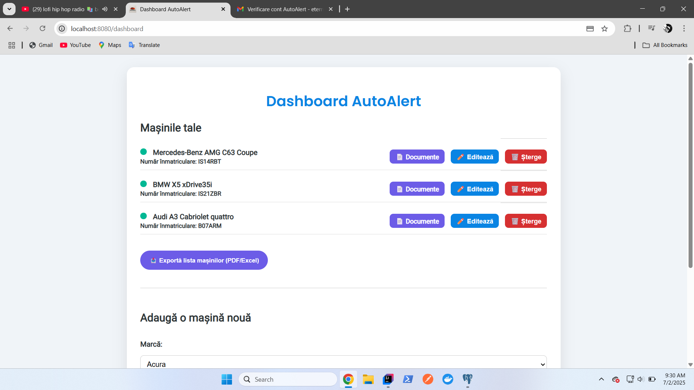
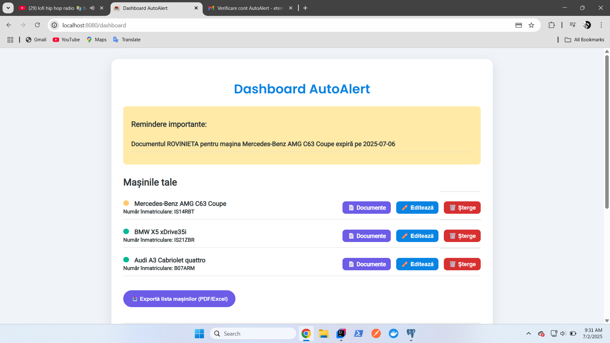
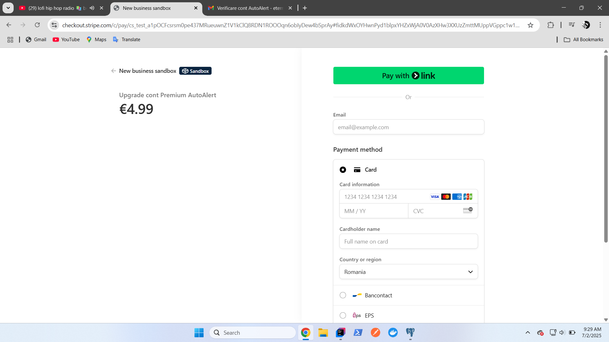

🚗 AutoAlert – Smart Car Reminder 

🌐 [Youtube presentation for AutoAlert](https://youtu.be/LDUhtDXhFZ8)

AutoAlert is a web-based application designed to help car owners track their vehicle documents and receive automatic reminders before expiration dates. It's built with Spring Boot and offers an intuitive interface for managing personal vehicles and related paperwork.

Features

- User Authentication – Register or log in to manage your vehicles and documents

- Add & Manage Cars – Users can register their cars with brand, model, and license plate

- Attach Car Documents – Add expiration dates for technical inspections (ITP), insurance (RCA), road tax, and more

- Automatic Status Calculation – Each car is marked as "valid", "warning" (7 days left), or "expired"

- Notification System – Email or audio alerts for documents nearing expiration

- Document Editing – Edit or update document details easily

- Premium Users – Unlock extra features like managing multiple cars or uploading scanned documents

- Stripe Integration – Pay to upgrade to a Premium account

Screenshots:

### Landing page
   

### Register / Login
  

### DashBoard

  

### PayMethod

